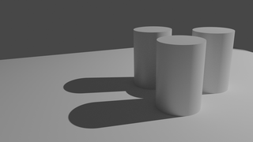
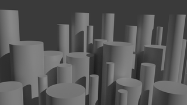
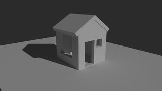
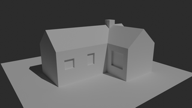
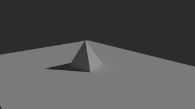

# Drawing Reference 3d

A repository containing simple 3d objects in blender. The aim to create free models with only basic shapes like sphere, cube, cylinders etc. for drawing practice.

User can play with light and camera to create desired composition.

---

<h2>
<a href="https://github.com/rahulsrma26/DrawingReference3D/raw/main/StackedBoxes.blend" download>Stacked Boxes</a>
</h2>

View Rendered: 
<a href="https://github.com/rahulsrma26/DrawingReference3D/raw/main/docs/renders/eevee/StackedBoxes.png" target="_blank">Eevee</a> or <a href="https://github.com/rahulsrma26/DrawingReference3D/raw/main/docs/renders/cycles/StackedBoxes.png">Cycles</a>

---

<h2>
<a href="https://github.com/rahulsrma26/DrawingReference3D/raw/main/Forts.blend" download>Forts</a>
</h2>

View Rendered: <a href="https://github.com/rahulsrma26/DrawingReference3D/raw/main/docs/renders/eevee/Forts.png" target="_blank">Eevee</a> or <a href="https://github.com/rahulsrma26/DrawingReference3D/raw/main/docs/renders/cycles/Forts.png" target="_blank">Cycles</a>

---

<h2>
<a href="https://github.com/rahulsrma26/DrawingReference3D/raw/main/Cylinders.blend" download>Cylinders</a>
</h2>

View Rendered: <a href="https://github.com/rahulsrma26/DrawingReference3D/raw/main/docs/renders/eevee/Cylinders.png" target="_blank">Eevee</a> or <a href="https://github.com/rahulsrma26/DrawingReference3D/raw/main/docs/renders/cycles/Cylinders.png" target="_blank">Cycles</a>

---

<h2>
<a href="https://github.com/rahulsrma26/DrawingReference3D/raw/main/AdvancedCylinders.blend" download>Advanced Cylinders</a>
</h2>

View Rendered: <a href="https://github.com/rahulsrma26/DrawingReference3D/raw/main/docs/renders/eevee/AdvancedCylinders.png" target="_blank">Eevee</a> or <a href="https://github.com/rahulsrma26/DrawingReference3D/raw/main/docs/renders/cycles/AdvancedCylinders.png" target="_blank">Cycles</a>

---

<h2>
<a href="https://github.com/rahulsrma26/DrawingReference3D/raw/main/House.blend" download>House</a>
</h2>

View Rendered: <a href="https://github.com/rahulsrma26/DrawingReference3D/raw/main/docs/renders/eevee/House.png" target="_blank">Eevee</a> or <a href="https://github.com/rahulsrma26/DrawingReference3D/raw/main/docs/renders/cycles/House.png" target="_blank">Cycles</a>

---

<h2>
<a href="https://github.com/rahulsrma26/DrawingReference3D/raw/main/BigHouse.blend" download>Big House</a>
</h2>

View Rendered: <a href="https://github.com/rahulsrma26/DrawingReference3D/raw/main/docs/renders/eevee/BigHouse.png" target="_blank">Eevee</a> or <a href="https://github.com/rahulsrma26/DrawingReference3D/raw/main/docs/renders/cycles/BigHouse.png" target="_blank">Cycles</a>

---
<<<<<<< HEAD

<h2>
<a href="https://github.com/rahulsrma26/DrawingReference3D/raw/main/Pyramid.blend" download>Pyramid</a>
</h2>

View Rendered: <a href="https://github.com/rahulsrma26/DrawingReference3D/raw/main/docs/renders/eevee/Pyramid.png" target="_blank">Eevee</a> or <a href="https://github.com/rahulsrma26/DrawingReference3D/raw/main/docs/renders/cycles/Pyramid.png" target="_blank">Cycles</a>

---
=======
>>>>>>> f43c2c234b51290f2e91336a52ddd439264f0d8f
