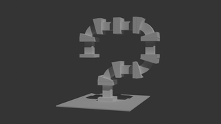
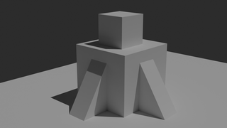

# Drawing Reference 3d

A repository containing simple 3d objects in blender for drawing practice.

---

## Stacked Boxes

View Rendered: [Eevee](docs/renders/eevee/StackedBoxes.png) or [Cycles](docs/renders/cycles/StackedBoxes.png)

---

## Forts

View Rendered: [Eevee](docs/renders/eevee/Forts.png) or [Cycles](docs/renders/cycles/Forts.png)

---
